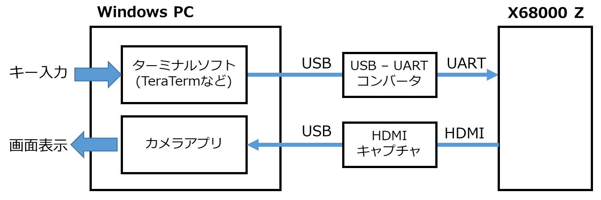
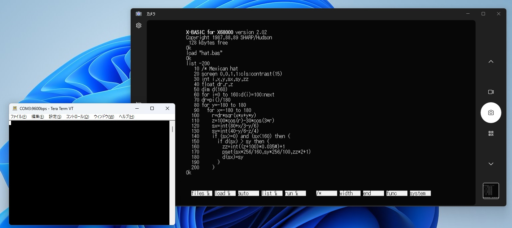

X68000 シリアルポートからの入力をキー入力に変換するツール auxtap.x
==================================================================

## 概要

X68000 のシリアルポートから受信したデータをキーボードから入力されたものとして扱うためのツールです。
例えば、シリアルから文字 'A' を受信すると、キーボードの 'A' キーを押した + 離したというキーコードを発生させます。

一見「何に使うのこれ?」というツールですが、例えば Windows 上で X68000Z のクロス開発を行う場合などに、X68000Z の画面表示もキー入力も Windows 上でまとめたいという用途を想定しています。\
(シリアルポートで繋がってさえいればいいので、もちろん X68000 実機でも使用できます)

このように接続して X68000Z 上で auxtap.x を実行しておくと、Windows のカメラアプリで X68000Z の画面を表示させつつ、TeraTerm からキー入力を行うような使い方ができるようになります。

起動ドライブの `AUTOEXEC.BAT` で `auxtap.x` を実行するようにしておけば、キーボードに一切触らずに X68000Z を操作できます。

ターミナルからの入力で X68000Z を操作する手段としては `ctty aux` コマンドがありますが、これと比較すると、以下のような特徴があります。

* `ctty` コマンドは DOS コールの標準入出力の先を切り替えるものなので、例えば X-BASIC のように入出力に DOS コールを使わないアプリは操作できませんが、`auxtap.x` は IOCS コールレベルでキー入力を発生させるので、ほとんどのアプリのキー操作に対応できます。
* `ctty` コマンドは入出力を完全にシリアルポート (AUX) に切り替えてしまうので、切り替え後はキーボードからの入力を受け付けなくなりますが、`auxtap.x` はキーボード入力とシリアルポート入力を併用できます。
* `auxtap.x` はシリアルポートからの入力一方向のみなので、画面表示は別途 HDMI キャプチャや他のディスプレイ表示に頼る必要がありますが、逆に表示が文字端末に制約されないのでグラフィック表示にも対応できます。

## 使い方

* `auxtap [-s<baud>]`
  * auxtap が常駐して、シリアルポートからの入力をキー入力に変換するようになります。
  * 常駐している間は、シリアルポートのデータ受信割り込みを auxtap が乗っ取るため、通常のシリアル入力　(IOCS _INP232C など) は動作しなくなります。
  * コマンドラインを省略すると、SRAM に設定されているデフォルトの通信速度を使用しますが、`-s` オプションで通信速度を指定できます。
* `auxtap -r`
  * auxtap の常駐を解除します。
  * 乗っ取っていたシリアルポートのデータ受信割り込みを元に戻します。

## ビルド方法

ビルドには [elf2x68k](https://github.com/yunkya2/elf2x68k) を使用します。
ツールチェインにパスが通った状態で `make` を実行するとコンパイルして `auxtap.x` が生成されます。

## ライセンス

MIT ライセンス
